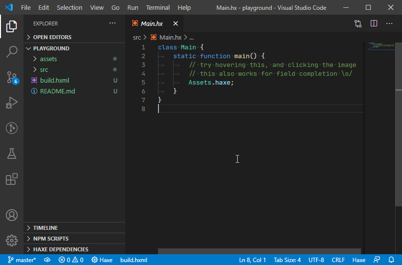

Just a small neat trick I invented for nice typed asset access IDE experience. Possible thanks to Haxe and VS Code.

See comments in the code to figure out how it works, maybe it'll be useful for you ;-)

